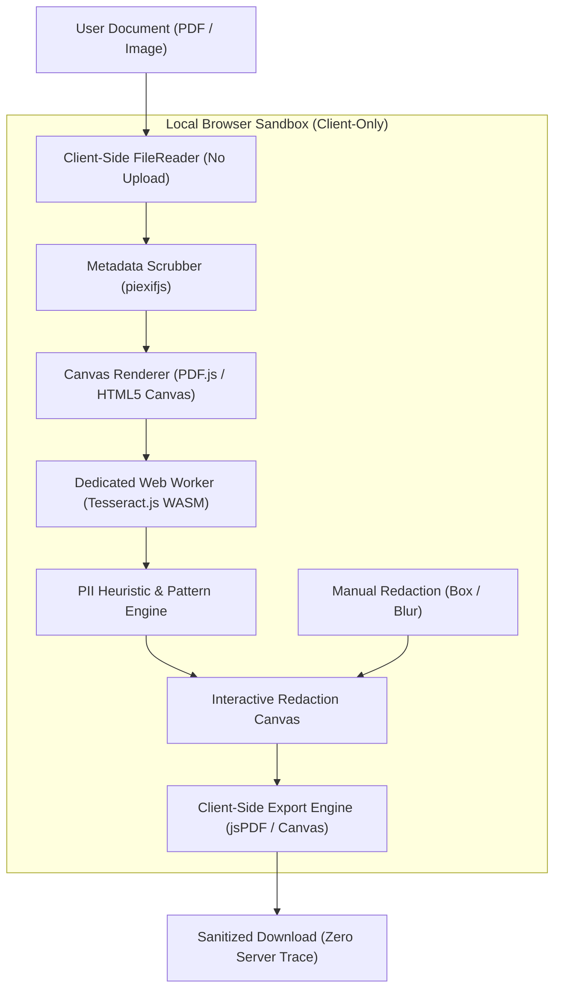

# OffGridDoc 🛡️

[](https://offgriddoc.pages.dev/)
[](https://react.dev/)
[](https://www.typescriptlang.org/)
[](https://vitejs.dev/)
[](https://web.dev/progressive-web-apps/)
[](https://opensource.org/licenses/MIT)

> **OffGridDoc** is a 100% offline, privacy-first document redaction Progressive Web App (PWA). It leverages client-side WebAssembly OCR to automatically detect and sanitize Personally Identifiable Information (PII) from PDFs and images. **Zero bytes ever leave your device.**

---

## ⚡ Why OffGridDoc?

Most online PDF and image redaction services upload your private files to remote cloud servers for processing. This presents significant data leakage risks for contracts, medical records, financial statements, and government IDs.

OffGridDoc runs entirely inside the client sandbox:
- **Zero Cloud Ingestion**: All OCR, canvas drawing, PDF compilation, and image manipulation take place locally in browser memory.
- **Air-Gapped Operation**: Once loaded or installed as a PWA, you can disconnect your internet entirely.
- **Compliance by Design**: Built according to Privacy-by-Design principles (GDPR Article 25) and HIPAA sanitization workflows.

---

## 🚀 Key Features

- **On-Device WebAssembly OCR**: Utilizes [Tesseract.js](https://github.com/naptha/tesseract.js) running in dedicated Web Workers to transcribe multi-language text without blocking UI frames.
- **Smart PII Detection & Auto-Redaction**: Fast regex-based heuristic detection for sensitive data points including:
  - Full Names & Identity credentials
  - Addresses, nationalities, and places of birth
  - Contact information (emails, phone numbers)
  - National tax identifiers and SSNs
- **Interactive Multi-Page PDF Viewer**: Powered by `pdfjs-dist`, offering smooth canvas-rendered page navigation, pan/zoom, and pixel-perfect redaction masks.
- **Dual Masking Modes**:
  - **Blackout Box**: Permanent opaque redactions ensuring text cannot be recovered underneath.
  - **Gaussian Blur**: Visual obscuring for lower-sensitivity context.
- **EXIF & Metadata Stripper**: Strips embedded device tags, timestamps, camera models, and GPS coordinates using `piexifjs` before file export.
- **Vector-Accurate Export**: Recompiles multi-page sanitized documents into clean PDFs using `jspdf` or high-resolution PNGs.
- **Glassmorphic Responsive UI**: Hand-crafted CSS custom property styling with dark mode and smooth animations.

---

## 🛠️ Architecture



---

## 💻 Tech Stack

| Layer | Technologies |
| :--- | :--- |
| **Framework & Language** | React 19, TypeScript 5, Modern JSX |
| **Build & Tooling** | Vite 8, Oxlint, TypeScript Compiler |
| **Core Libraries** | Tesseract.js 7 (WASM), PDF.js (`pdfjs-dist`), jsPDF, Piexifjs |
| **Icons & Styling** | Lucide-React, CSS3 Variables, Glassmorphism, CSS Grid/Flexbox |
| **PWA & Storage** | Vite Plugin PWA, Workbox Service Worker, CacheStorage |
| **Deployment** | Cloudflare Pages with automated edge distribution |

---

## 🚦 Getting Started

### Prerequisites
- Node.js (v18 or newer)
- npm or yarn

### Installation
```bash
# Clone the repository
git clone https://github.com/Etherdancer/offgriddoc.git

# Navigate to project folder
cd offgriddoc

# Install dependencies
npm install

# Start local development server
npm run dev
```

### Production Build & Linting
```bash
# Typecheck and compile production bundle to /dist
npm run build

# Run high-performance linter
npm run lint

# Preview production build locally
npm run preview
```

---

## 📄 License

This project is licensed under the [MIT License](LICENSE).
